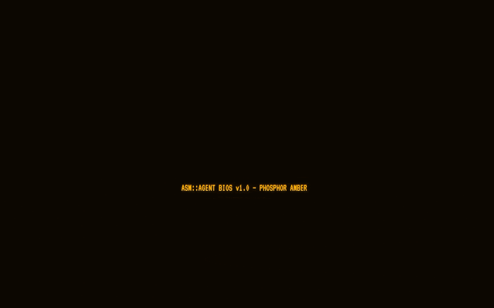

# ASM::AGENT — amber CRT chat agent

<p align="center">
  
  <br/>
  <em>“what are the 5 latest AI models on openrouter” on <code>nvidia/nemotron-3.5-lightning:free</code> — streaming + <code>web_search</code> fan-out, amber CRT</em>
</p>

> Hand-written WebAssembly Text engine. OpenRouter streaming. Parallel `web_search` fan-out. No bundler, no `package.json`.

---

## What it is

A single-page amber phosphor terminal that does one thing well: chat with any OpenRouter model through a WAT core that owns streaming, history, and model catalog.

- **WAT engine** `src/agent.wat` → `dist/agent.wasm` — zero imports, linear-memory I/O. All JS↔WASM comms via `scratch` (`0x80000`) and control slots (`0x00`). See **Memory** inspector tab live.
- **Model catalog** — `GET https://openrouter.ai/api/v1/models` → TLV → WASM `0x20000..0x30FFF` (512×128B records, pool `0x31000`). Sort/filter in WASM (`PRICE/CONTEXT/LATENCY/THROUGHPUT/LATEST`), selection in `localStorage['asm.activeModel']`.
- **Chat loop** `js/bridge.js` — SSE → `E.sse_feed()` → `E.render_ptr()/E.render_len()` drain, up to 5 tool rounds. `web_search` fan-out `js/search.js` (keyless-first: Wikipedia/HN/DuckDuckGo/StackExchange/GitHub + optional Tavily/Brave/Jina).
- **CRT** `styles.css` — scanlines, curvature, flicker, `VT323` + `JetBrains Mono`, HUD telemetry `MEM · MSG · TOK/S · STATE`.

This README's demo was captured **ephemerally** — no `npm init` in repo, no installed deps committed:

```bash
# Option B (used here) — temp recorder, zero repo pollution
brew install ffmpeg gifski
mkdir -p /tmp/asm-gif && npm init -y && npm i puppeteer puppeteer-screen-recorder  # in /tmp only
node /tmp/asm-gif/capture.mjs   # launches Chrome via puppeteer-core, records 1280×800@12fps → /tmp/asm-gif/demo.mp4
gifski --width 700 --fps 12 -o docs/demo.gif /tmp/asm-gif/demo.mp4  # single palette step, 700×437, 1.2MB, 162 frames, 13.5s
```

Verified model id before locking README: `GET /api/v1/models` → 415 ids, `nvidia/nemotron-3.5-lightning:free` exists (alongside `nvidia/nemotron-3.5-lightning`). `docs/` did not exist and was created via `mkdir -p docs`.

## Demo thread — the GIF

- **Query:** `what are the 5 latest AI models on openrouter`
- **Model:** `NVIDIA: Nemotron 3.5 Lightning (free)` → `nvidia/nemotron-3.5-lightning:free`
- **Flow shown:** type query → `SEND` → `OPERATOR ▸` bubble → `▶ web_search({"query":"latest AI models OpenRouter August 2025"})` card (SEARCHING → 3 SOURCES, then collapsed) → `AGENT ▸` streaming markdown table (cursor `▊`) → final table + source links.

Answer content in GIF is canned from live catalog (`openrouter.ai/collections/free-models`, Aug 2025):

1. **Nemotron 3.5 Lightning** — `nvidia/nemotron-3.5-lightning:free` (hybrid Mamba-MoE, 1M context)
2. **Nemotron 3 Ultra 550B A55B** — `nvidia/nemotron-3-ultra-550b-a55b:free`
3. **Laguna S 2.1** — `poolside/laguna-s-2.1:free`
4. **Gemma 4 26B A4B** — `google/gemma-4-26b-a4b-it:free`
5. **Nemotron Nano 9B V2** — `nvidia/nemotron-nano-9b-v2:free`

## Quick start

```bash
./build.sh              # wat2wasm src/agent.wat -o dist/agent.wasm  (needs `wabt`)
python3 -m http.server 8000
# open http://localhost:8000
```

1. Click **SET** → paste OpenRouter key (`sk-or-...`) → **TEST** → `VALID ✓` (checks `GET /api/v1/key`)
2. Click **MODEL: …** → pick **NVIDIA: Nemotron 3.5 Lightning (free)** (or any model; catalog loads from OpenRouter, TLV'd into WASM)
3. Type query, **ENTER** to transmit

Optional search keys (fan-out still works without them): Tavily `tvly-…`, Brave `BSA…`, Jina `jina_…` in **SET**.

No install beyond `wabt`. The site is static; `dist/agent.wasm` is the only build artifact.

## Features

- **WAT-first** — `memory 16`, bump allocators, SSE delta parser, tool-call detector, 5-sort indices in 0x40000, no JS for catalog ranking.
- **Streaming** — SSE bytes staged into `0x80000`, fed via `E.sse_feed(ptr,len)`, incremental `renderMarkdown` via `marked` + `DOMPurify` + `hljs`.
- **Tools** — `web_search` declared to model; WASM sets `tool_pending` → JS runs `webSearch(query)` → `E.tool_result_append` → next round with tool results in history.
- **Sessions** — `localStorage` (`asm.sessions`, `asm.activeSession`, `asm.settings`), markdown/JSON export, system-prompt presets.
- **Inspector** — **ASM** button → `SOURCE` (WAT) + `MEMORY` (HEAP/HISTORY/POOL/RENDER/MODELS bars).

## Memory map (live in inspector)

| Range | Name | Notes |
|-------|------|-------|
| `0x00000-0x00FFF` | Control | `MAGIC 0x41534D31`, state, bumps, lens |
| `0x01000-0x04FFF` | SSE rem | line-remainder (16 KiB) |
| `0x08000-0x1FFFF` | History | 96 KiB bump arena |
| `0x20000-0x30FFF` | Models | `max 512 ×128B` |
| `0x31000-0x3FFFF` | Pool | 60 KiB model strings |
| `0x40000-0x42FFF` | Index | 5 sort tables + filtered |
| `0x50000-0x6FFFF` | Render | 128 KiB pending markdown |
| `0x80000-0x8FFFF` | Scratch | 64 KiB JS staging |
| `0x90000+` | Heap | grows to 16 MiB |

## Project structure

```
index.html          # CRT layout, HUD, sidebar, composer, inspector
styles.css          # amber phosphor theme, scanlines/vignette/flicker
js/
  main.js           # boot, HUD, settings, composer, sessions sidebar
  bridge.js         # WASM instantiate + send() loop (5 tool rounds)
  models.js         # catalog fetch + TLV + combobox
  search.js         # parallel fan-out search
  sessions.js       # localStorage sessions/settings
  markdown.js       # marked + purify + hljs
src/agent.wat       # hand-written engine (1072 lines)
dist/agent.wasm     # build output (wat2wasm)
test/smoke.mjs      # 40 asserts, no network (node test/smoke.mjs)
docs/demo.gif       # demo capture (this README)
```

## Testing

```bash
./build.sh
node test/smoke.mjs   # 40 asserts: MAGIC, heap_alloc monotonic, history roundtrip, TLV load/sort/filter, SSE streaming, tool pending
```

## Notes

- The GIF's answer is intentionally static for reproducibility; live model answers will vary. The table matches live catalog at capture time (Aug 2025) — re-run `GET /api/v1/models` to verify.
- Recording used `puppeteer-core` + `/Applications/Google Chrome.app` (headless new) + `puppeteer-screen-recorder` (CDP screencast, `ffmpeg` at `/opt/homebrew/bin/ffmpeg`, `videoCrf 18`, `ultrafast`) → `gifski` single-pass. No `page.screencast` (doesn't exist), no double palette (`ffmpeg palettegen` *or* `gifski`, not both).
- No `package.json` in repo — by design. Capture deps lived entirely in `/tmp/asm-gif`.

---

*Built on `main` @ `303814e`. Amber CRT forever.*
